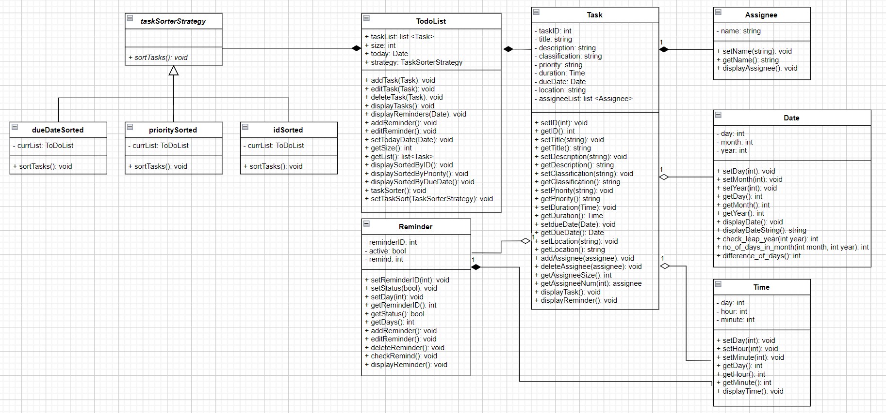
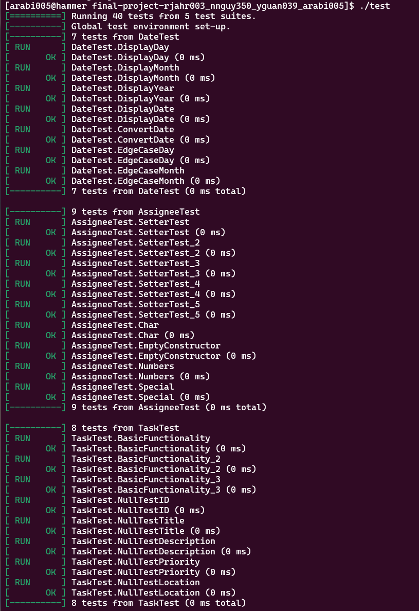
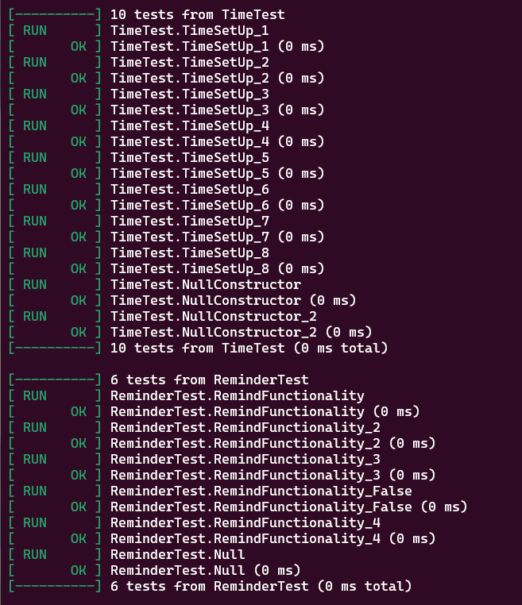

## Project Description
In the task scheduler, the user can create tasks that include a title, description, classification (e.g. personal, work, study), priority, duration and due date which are the inputs. Users can also create task lists where each list includes multiple tasks. Users can display, edit, and delete tasks and task lists. There will be features such as customizable reminders that will remind you when a task is due. You will also be able to assign people to tasks. This is an interesting project to us because as students we will get to use this task scheduler in our daily life to help us with time management. This project will be coded in C++. The libraries we used are string, iostream, lists, and ctime. We also used the google-test framework for our unit test.

 ## Class Diagram

**Class diagram description:**

UML Class diagram for task scheduler. The task scheduler has 6 classes: Task, TodoList, Reminder, Assignee, Date, and Time. 

**Task**: Class for creating a task. This will be the core class of this project. Each task could have an ID, title, description, classification, priority, duration, due date, location, and a list of assignees. There are getter and setter methods for these variables. You can add and delete assignees from each task. There are also helper functions that will allow you to know the number of assignees. There is also a display function which will display the task.

**TodoList**: Class for creating a list of tasks. You can add, edit, delete, and display tasks.

**Reminder**: Class for setting reminders for tasks. Each reminder has an ID, activation status, and remind (number of days in advance of due date that you want to be reminded). There are getter and setter functions for these variables. You can add, edit, or delete a reminder. There is a checkRemind method that will check to see if it needs to remind you. There is also a display reminder function that will display your reminders.

**Assignee**: Class for task assignees. Each assignee has a name. There are methods for setting and getting the name as well as displaying the assignee.

**Date**: Class for Date. Each date has a day, month, and year. You can get and set each of day, month, and year with the getter and setter methods. You can also display the date.

**Time**: Class for time. You can use this class to set durations for both tasks and reminders. You can set days, hours, and minutes and get them using the getter and setter method. There is also a display funciton that will display the time.

Each task will need an assignee thus why there is a composition relation between them. Tasks may have a reminder, a due date (Date), and a duration (Time) assigned to them thus why there is a aggregation realtion between them. You can create a list of tasks which is shown in the TodoList class. TodoList class requires tasks in order to create a list of them thus why there is a composition relation between them. 

Using **Strategy Design Pattern**: The task list needs to be sorted based on the user’s needs. The reason why Strategy Design Pattern is helpful is because there are multiple ways to sort the same tasks. We will create a new class named taskSorterStrategy which will act as the strategy class. There will be 3 implementations of sorting (inheriting from taskSorterStrategy: Tasks sorted based on ID, Tasks sorted based on due date, Tasks sorted based on priority. The taskSorterStrategy class will have a composition relation with the toDoList class. This design pattern will help us write better code since the common solution between these algorithms is sorting the tasks and we will be able to switch between algorithms based on the user's needs. 

 
 ## Screenshots
Screenshots of the Input/Output of Our Application

Today's Date:

Main Menu:

Add Task:

Edit Task:

Remove Task:

Add Reminder:

Edit Reminder:

Display (Task by earliest Addition):

Display (Task by sorted ID):

Display (Task by sorted priority):

Display (Task by sorted dueDate):

Display (Reminders):

Change Today's Date:

 ## Installation/Usage
1. Start by going to this Github's repository and get the cloning link by pressing the green button named "Code". Then clone this GitHub Repository on your local terminal. 
2. Run "cmake3 ." 
3. Run "make" on your command line.
4. Run ./main on your command line.
5. Input todays date 
6. Task Scheduler is ready!
 ## Testing

How this project was tested:

1. Unit Tests were created to test the functions in the Date class. 
2. Unit Tests were created to test the functions in the Assignee class.
3. Unit Tests were created to test the functions in the Reminder class.
4. Unit Tests were created to test the functions in the Task Class.
5. Unit Tests were created to test the functions in the Time Class.
6. Unit Tests were created to test the ToDoList Class. (manual testing was done since methods were void type)
7. Unit Tests were created to test the IdSorted Class. (manual testing was done since methods were void type)
8. Unit Tests were created to test the PrioritySorted Class. (manual testing was done since methods were void type)
9. Unit Tests were created to test the DueDateSorted Class. (manual testing was done since methods were void type)
10. Valgrind was used to check for memory leaks in the entire program
 
