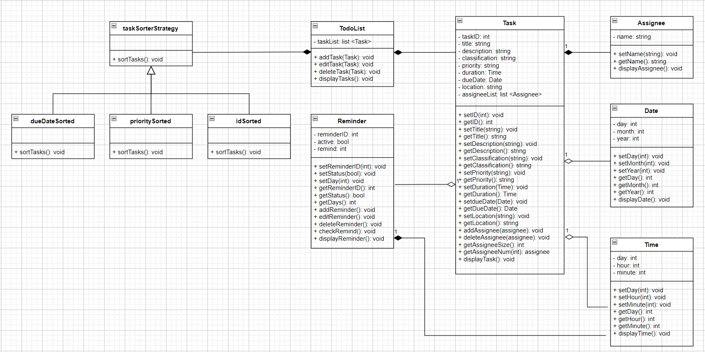

# Task Scheduler
Authors: \<[Rasa Jahromi](https://github.com/rjdahomie)\> \<[Alexander Rabinovich](https://github.com/thecornerhob)\> \<[Nathan Nguyen](https://github.com/shipapa1)\> \<[Yongkang Guan](https://github.com/yguan039)\>
 

## Project Description
In the task scheduler, the user can create tasks that include a title, description, classification (e.g. personal, work, study), priority, duration and due date which are the inputs. Users can also create task lists where each list includes multiple tasks. Users can display, edit, and delete tasks and task lists. There will be features such as location based reminders (Arbitrary locations) and customizable reminders that will remind you when a task is due. You will also be able to assign people to tasks. This is an interesting project to us because as students we will get to use this task scheduler in our daily life to help us with time management. This project will be coded in C++.

 ## Class Diagram

**Class diagram description:**

UML Class diagram for task scheduler. The task scheduler has 6 classes: Task, TodoList, Reminder, Assignee, Date, and Time. 

**Task**: Class for creating a task. This will be the core class of this project. Each task could have an ID, title, description, classification, priority, duration, due date, location, and a list of assignees. There are getter and setter methods for these variables. You can add and delete assignees from each task. There are also helper functions that will allow you to know the number of assignees. There is also a display function which will display the task.

**TodoList**: Class for creating a list of tasks. You can add, edit, delete, and display tasks.

**Reminder**: Class for setting reminders for tasks. Each reminder has an ID, activation status, and remind (number of days in advance of due date that you want to be reminded). There are getter and setter functions for these variables. You can add, edit, or delete a reminder. There is a checkRemind method that will check to see if it needs to remind you. There is also a display reminder function that will display your reminders.

**Assignee**: Class for task assignees. Each assignee has a name. There are methods for setting and getting the name as well as displaying the assignee.

**Date**: Class for Date. Each date has a day, month, and year. You can get and set each of day, month, and year with the getter and setter methods. You can also display the date.

**Time**: Class for time. You can use this class to set durations for both tasks and reminders. You can set days, hours, and minutes and get them using the getter and setter method. There is also a display funciton that will display the time.

Each task will need an assignee thus why there is a composition relation between them. Tasks may have a reminder, a due date (Date), and a duration (Time) assigned to them thus why there is a aggregation realtion between them. You can create a list of tasks which is shown in the TodoList class. TodoList class requires tasks in order to create a list of them thus why there is a composition relation between them. 

Using **Strategy Design Pattern**: The task list needs to be sorted based on the user’s needs. The reason why Strategy Design Pattern is helpful is because there are multiple ways to sort the same tasks. We will create a new class named taskSorterStrategy which will act as the strategy class. There will be 3 implementations of sorting (inheriting from taskSorterStrategy: Tasks sorted based on ID, Tasks sorted based on due date, Tasks sorted based on priority. The taskSorterStrategy class will have a composition relation with the toDoList class. This design pattern will help us write better code since the common solution between these algorithms is sorting the tasks and we will be able to switch between algorithms based on the user's needs. 

 
 > ## Final deliverable
 > All group members will give a demo to the TA/reader during lab time. The TA/reader will check the demo and the project GitHub repository and ask a few questions to all the team members. 
 > Before the demo, you should do the following:
 > * Complete the sections below (i.e. Screenshots, Installation/Usage, Testing)
 > * Plan one more sprint (that you will not necessarily complete before the end of the quarter). Your In-progress and In-testing columns should be empty (you are not doing more work currently) but your TODO column should have a full sprint plan in it as you have done before. This should include any known bugs (there should be some) or new features you would like to add. These should appear as issues/cards on your Project board.
 > * Make sure your README file and Project board are up-to-date reflecting the current status of your project (e.g. any changes that you have made during the project such as changes to your class diagram). Previous versions should still be visible through your commit history. 
 
 ## Screenshots
 > Screenshots of the input/output after running your application
 ## Installation/Usage
 > Instructions on installing and running your application
 ## Testing
 > How was your project tested/validated? If you used CI, you should have a "build passing" badge in this README.
 
